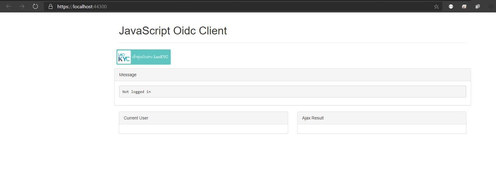
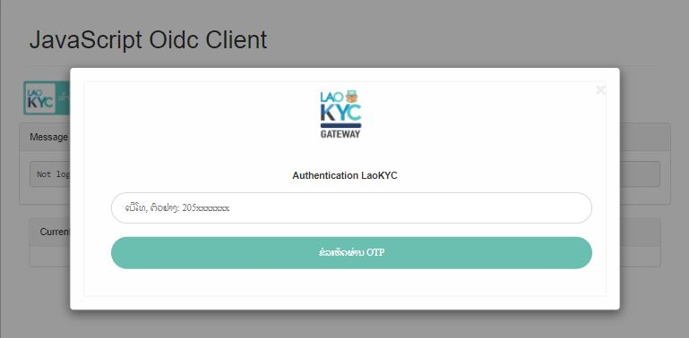
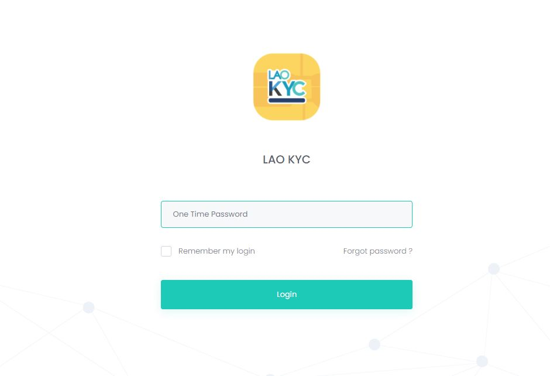
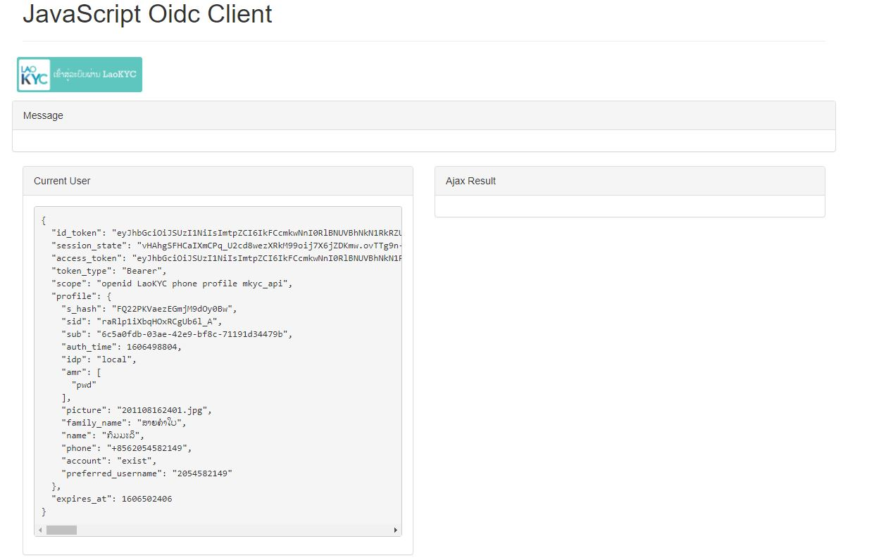

# LaoKYC- Adding a JavaScript client


This quickstart will show how to build a browser-based JavaScript client application (sometimes referred to as a `Single Page Application` or `SPA`).

The user will login to IdentityServer, invoke the web API with an access token issued by IdentityServer, and logout of IdentityServer. 
All of this will be driven from the JavaScript running in the browser.

## New Project for the JavaScript client

Modify the `JavaScriptClient` project to run on https://localhost:44300.

This middleware will now serve up static files from the application's `~/wwwroot` folder.
This is where we will put our HTML and JavaScript files.
If that folder does not exist in your project, create it now.

## Reference oidc-client

In this quickstart in the `JavaScriptClient` project we need a similar library, except one that works in JavaScript and is designed to run in the browser.
The [oidc-client library](https://github.com/IdentityModel/oidc-client-js) is one such library. 
It is available via [PM](https://github.com/IdentityModel/oidc-client-js), [Bower](https://bower.io/search/?q=oidc-client>),  as well as a [direct download from github.](https://github.com/IdentityModel/oidc-client-js/tree/release/dist)

**NPM**

If you want to use NPM to download `oidc-client`, then run these commands from your `JavaScriptClient` project directory

    npm i oidc-client
    copy node_modules\oidc-client\dist\* wwwroot

This downloads the latest `oidc-client` package locally, and then copies the relevant JavaScript files into `~/wwwroot` so they can be served up by your application.

**Manual download**

If you want to simply download the `oidc-client` JavaScript files manually, browse to [the GitHub repository](https://github.com/IdentityModel/oidc-client-js/tree/release/dist)  and download the JavaScript files. Once downloaded, copy them into `~/wwwroot` so they can be served up by your application.

**LaoKYC JS Lib**

You must download our Lib from our [Github repository](https://github.com/LaoKYC/LaoKYC-JavaScript/blob/main/JsOidc/wwwroot/libs/kyc-oidc.min.js) to automate login button and form

### Add your HTML and JavaScript files


Next is to add your HTML and JavaScript files to `~/wwwroot`.
We will have two HTML files and one application-specific JavaScript file (in addition to the `oidc-client.js` library).
In `~/wwwroot`, add a HTML file named `index.html` and `callback.html`, and add a JavaScript file called `app.js`.

**index.html**

This will be the main page in our application. 
It will simply contain the HTML for the buttons for the user to login, logout, and call the web API.
It will also contain the ``<script>`` tags to include our two JavaScript files.
It will also contain a ``<pre>`` used for showing messages to the user.

It should look like this
```
<!DOCTYPE html>
<html xmlns="http://www.w3.org/1999/xhtml">
<head>
    <title></title>
    <link href="libs/bootstrap.min.css" rel="stylesheet" />
    <link href="StyleSheet.css" rel="stylesheet" />
</head>
<body>
    <div class="container">
        <header class="page-header">
            <h1>JavaScript Oidc Client</h1>
        </header>

        <div class="row">
            <div id="kyc-login"></div>
        </div>

        <div class="row">
            <ul class="list-unstyled list-inline">
            </ul>
        </div>

        <div class="row">
            <div class="panel panel-default">
                <div class="panel-heading">Message</div>
                <div class="panel-body">
                    <pre id="response"></pre>
                </div>
            </div>
        </div>

        <div class="row">
            <div class="col-sm-6">
                <div class="panel panel-default">
                    <div class="panel-heading">Current User</div>
                    <div class="panel-body">
                        <pre id="id-token"></pre>
                    </div>
                </div>
            </div>

            <div class="col-sm-6">
                <div class="panel panel-default">
                    <div class="panel-heading">Ajax Result</div>
                    <div class="panel-body">
                        <pre id="ajax-result"></pre>
                    </div>
                </div>
            </div>
        </div>
    </div>

    <script src="libs/oidc-client.js"></script>
    <script type="module" defer src="app.js"></script>
</body>
</html>

```
**app.js**

This will contain the main code for our application.
The first thing is to add a ``kyc-oidc.min.js`` to ``libs`` folder. Then ``import`` module

```
import Configuration, { renderUI, showTokens } from './libs/kyc-oidc.min.js'
```

Next, we can use the ``Configuration`` class from the `kyc-oidc` library to manage the OpenID Connect protocol. 
It requires similar configuration that was necessary in the MVC Client (albeit with different values). 
Add this code to configure and instantiate the ``UserManager``

```
var config = new Configuration('https://login.oneid.sbg.la',
    'js',
    'https://localhost:44300/callback.html',
    'https://localhost:44300/',
    'code', 'openid LaoKYC phone profile', true);
```

For constructor we have important parameters:
Parameter | Value |Description 
----- | ----- | ---------- 
authority | https://login.oneid.sbg.la | this is authority Uri
client_id | js | this is client ID, you should used other client for production
redirect_uri | https://localhost:44300/callback.html | this is redirect uri, where can our SSO redirect back to your app/site after login success
post_logout_redirect_uri | https://localhost:44300/ | this is redirect uri, where can out SSO redirect back to your app/site after logout success
response_type | code | this is response type, we used code for SPA and other native app
scope | openid LaoKYC phone profile | this is scope where can client access to resources
revokeAccessTokenOnSignout | true | we allow revoke access token when token is refernce type

Next, we can use the ``renderUI`` function to render Login UI

```
renderUI(config, 'lo');
```

Next, we display info after login callback to selector ``<div id="id-token"></div>

```
showTokens(config, '#id-token');
```

**callback.html**

This HTML file is the designated ``redirect_uri`` page once the user has logged into IdentityServer.
It will complete the OpenID Connect protocol sign-in handshake with IdentityServer. 
The code for this is all provided by the ``UserManager`` class we used earlier. 
Once the sign-in is complete, we can then redirect the user back to the main `index.html` page. 
Add this code to complete the signin process

    <!DOCTYPE html>
    <html>
    <head>
        <meta charset="utf-8" />
        <title></title>
    </head>
    <body>
        <script src="libs/oidc-client.js"></script>
        <script>
            new Oidc.UserManager({response_mode:"query"}).signinRedirectCallback().then(function() {
                window.location = "index.html";
            }).catch(function(e) {
                console.error(e);
            });
        </script>
    </body>
    </html>

 
### Run the JavaScript application

Now you should be able to run the JavaScript client application:



Click the "Request OTP" button to request one time password:
 


Click the "Login" button to sign the user in.
Once the user is returned back to the JavaScript application, you should see their profile information:
 


Now application will callback to index.html



